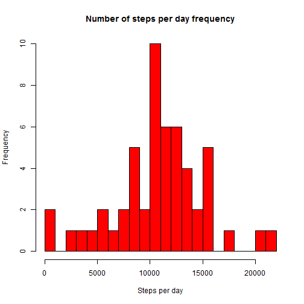
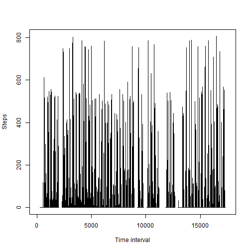
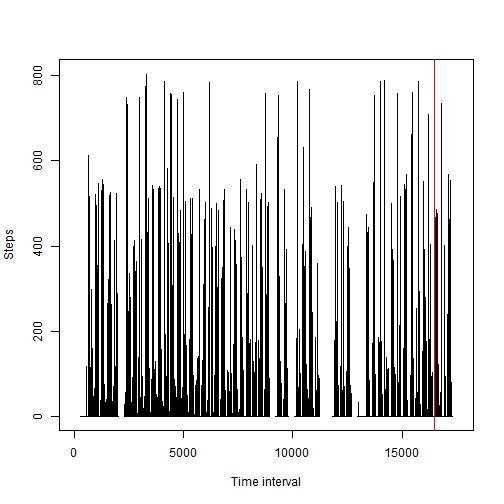
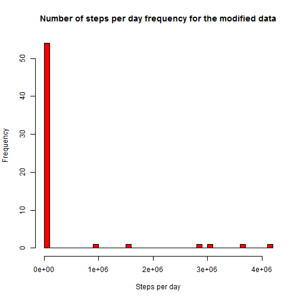
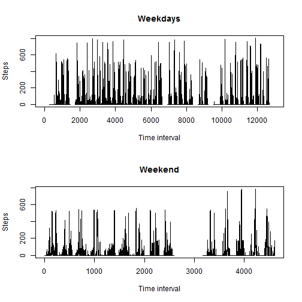

# Reproducible Research: Peer Assessment 1


## Loading and preprocessing the data

```r
a <- read.csv("activity.csv", header = TRUE, sep = ",")
```


## What is mean total number of steps taken per day?

First we'll sum the number of steps per day and then make a histogram of the vector of those sums.


```r
perDay <- aggregate(steps ~ date, data = a, FUN = sum)
hist(perDay$steps, breaks = 30, col = "red", main = "Number of steps per day frequency", xlab = "Steps per day")
```

 

The **mean** of total steps per day:

```r
mu <- mean(perDay$steps); mu
```

```
## [1] 10766
```

The **median** of total steps per day:

```r
med <- median(perDay$steps); med
```

```
## [1] 10765
```


## What is the average daily activity pattern?

Time series of the 5-minute interval and the average number of steps taken.

```r
plot(a$steps, type = "l", xlab = "Time interval", ylab = "Steps")
```

 

The interval at which the maximum number of steps appears:

```r
which.max(a$steps)
```

```
## [1] 16492
```

We mark this interval with the red line on the time series plot.

```r
plot(a$steps, type = "l", xlab = "Time interval", ylab = "Steps")
abline(v = which.max(a$steps), col = "red")
```

 


## Imputing missing values

Total number of missing values in the dataset

```r
sum(is.na(a$steps))
```

```
## [1] 2304
```

We modify the data in order to eliminate missing data. Whenever we encounter an `NA` value, we will put the median for that day.

```r
a2 <- a
idx <- which(is.na(a2), arr.ind=TRUE)
a2[idx] <- perDay$step[as.numeric(as.Date(a2$date[idx[, 1]])-as.Date("2012-10-01")) + 1]
```

Histogram of total number of steps with regards to the new data.

```r
perDay2 <- aggregate(steps ~ date, data = a2, FUN = sum)
hist(perDay2$steps, breaks = 30, col = "red", main = "Number of steps per day frequency for the modified data", xlab = "Steps per day")
```

 

The mean of total steps per day:

```r
mu2 <- mean(perDay2$steps)
mu2
```

```
## [1] 279515
```

The median of total steps per day:

```r
med2 <- median(perDay2$steps)
med2
```

```
## [1] 11405
```

The difference of the means and medians with and without the NA values filled in:

```r
mu2 - mu
```

```
## [1] 268749
```

```r
med2 - med
```

```
## [1] 640
```

It is clear that the median is not changed all that much, but the mean is very different if we fill in the missing data by ourselves. 

The moral is that we shouldn't really guess at the missing data since it can alter the results drastically.


## Are there differences in activity patterns between weekdays and weekends?


```r
a <- transform(a, weekend=as.POSIXlt(date, format='%Y-%m-%d')$wday %in% c(0, 6))
day <- rep("weekday", dim(a)[1])
day[a$weekend] <- "weekend"
s <- split(a, day)
par(mfrow = c(2, 1))
plot(s$weekday$steps, type = "l", main = "Weekdays", xlab = "Time interval", ylab = "Steps")
plot(s$weekend$steps, type = "l", main = "Weekend", xlab = "Time interval", ylab = "Steps")
```

 

It is clear that the activity is greater during weekdays than at weekend.
